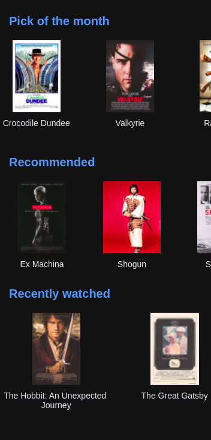

# Mobile App made with React Native and Expo CLI

&nbsp;

# Prerequisites

1. Have [Expo CLI](https://reactnative.dev/docs/environment-setup) installed on your machine
2. If you want to test with mobile phone you will need to install Expo Go app on your phone

# Installation

1. Clone the GitHub repo to your PC
2. Open project folder in terminal and run `npm install`
3. Launch the server using `npm start`
4. Scan the QR code with Expo Go or Camera app (iOS) to open on mobile phone, or open http://localhost:19002 on your PC and click "Run in web browser" option above the QR code to explore in the Web Browser.

&nbsp;

# Screenshots

&nbsp;

## MOBILE

&nbsp;

## Homepage

&nbsp;

&nbsp;

## Detail page

&nbsp;

&nbsp;

&nbsp;

